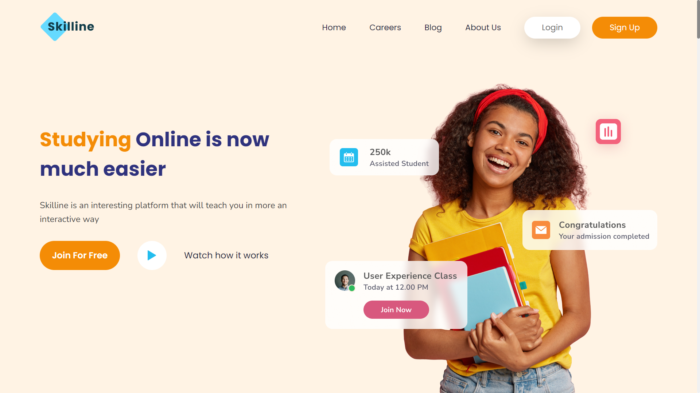

# Online Learning Landing Page
- Practice slicing skills using `HTML`, `CSS`.
- Design reference: [Online Learning](https://codedesign.dev/challenge/online-learning).
- This website is not responsive, and has a width of 1920x1080

## Preview


## Locally
```bash
git clone https://github.com/weiwei2694/online-learning-landing-page.git
cd online-learning-landing-page
```